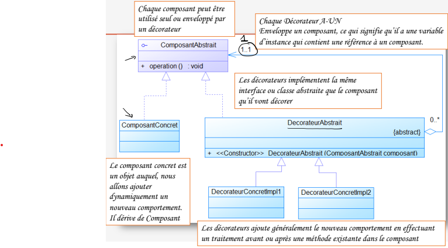

# Projet Java - Pattern Décorateur

Ce projet est développé en Java avec Maven. Il met en œuvre le **pattern décorateur** (Decorator Pattern).

## Description

Le pattern décorateur est un patron de conception structurel qui permet d’ajouter dynamiquement des fonctionnalités à un objet sans modifier son code source. Il repose sur la composition plutôt que sur l’héritage, en enveloppant l’objet original dans un ou plusieurs objets décorateurs.

### Avantages

- Ajout de fonctionnalités sans modifier la classe de base.
- Flexibilité accrue par rapport à l’héritage.
- Possibilité de combiner plusieurs décorateurs.

### Exemple d’utilisation

Supposons une interface `Boisson` avec une méthode `getDescription()` et `cout()`. On peut créer des décorateurs comme `Lait` ou `Chocolat` qui ajoutent des fonctionnalités à une boisson de base.

## Résultat d'exécution

```bash
Sumatra
Description: Sumatra
Cout: 6.0
Espresso
Description: Espresso
Cout: 12.0
----- Avec Decorateur -----
Ajout de Chocolat
Description: Espresso + Chocolat
Cout: 12.5
Ajout de Caramel
Description: Espresso + Chocolat + Caramel
Cout: 13.25
Ajout de Chocolat
Description: Espresso + Chocolat + Caramel + Chocolat
Cout: 13.75
Ajout de Noisette
Description: Espresso + Chocolat + Caramel + Chocolat + Noisette
Cout: 14.75
```
## Diagramme Decorateur


